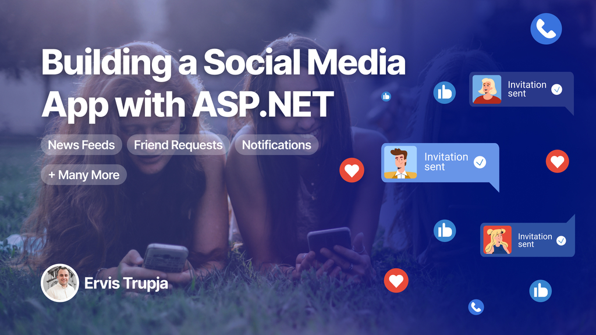

# Welcome to My GitHub Profile!

## Featured Course: **Build Your Own Social Media Platform with ASP.NET**

**Are you ready to dive deep into the world of web development with ASP.NET?** Here's your chance to learn how to build a comprehensive social media application from the ground up!

### What You Will Learn:

- **Core Features Implementation:**
  - **Stories, Posts, Likes, Shares:** Implement the backbone of any social media platform.
  - **Friend Management:** Develop systems for adding, canceling, ignoring, and approving friend requests.
  - **Trending Hashtags:** Create a dynamic section to showcase popular tags, keeping your app engaging and relevant.

- **Front-End with Tailwind CSS:**
  - Learn to design a modern, responsive user interface using Tailwind CSS. Utilize its utility-first approach to speed up your development process.

- **ASP.NET MVC Framework:**
  - Master the ASP.NET MVC framework for structuring your application with a clear separation of concerns, enhancing maintainability and scalability.

- **Data Management:**
  - **ASP.NET Data Project & Entity Framework:** Handle database operations with ease. Learn to:
    - Use Entity Framework migrations to manage schema changes.
    - CRUD operations: Create, Read, Update, Delete data.
    - Set up and interact with an SQL database for secure data storage.

- **Deployment on Azure:**
  - Deploy your application to the cloud using Azure. Understand how to:
    - Configure a CI/CD pipeline for continuous integration and deployment.
    - Ensure your app is always live, updated, and running smoothly in production.

### By The End of This Course:

You'll not only have a fully operational social media platform but also the expertise to tackle complex web applications, manage data efficiently, and deploy solutions in the cloud.

**Ready to build something amazing?** Dive into this course and start your journey from a blank Visual Studio project to a vibrant social media application!

[Enroll Now](#) 

---

### Connect with Me

- **LinkedIn:** [Ervis Trupja](https://al.linkedin.com/in/ervistrupja)
- **Twitter:** [@ervis_trupja](https://x.com/ervis_trupja)
- **Email:** [Drop me a line](mailto:ervistrupja@outlook.com)

### Check out my other courses

- **LinkedIn Learning:** (https://www.udemy.com/user/ervis-trupja)
- **Udemy:** (https://linkedin.com/in/ervistrupja)
- **Pluralsight:** (https://www.pluralsight.com/author/ervis-trupja)

Feel free to explore, contribute, or just say hello!
